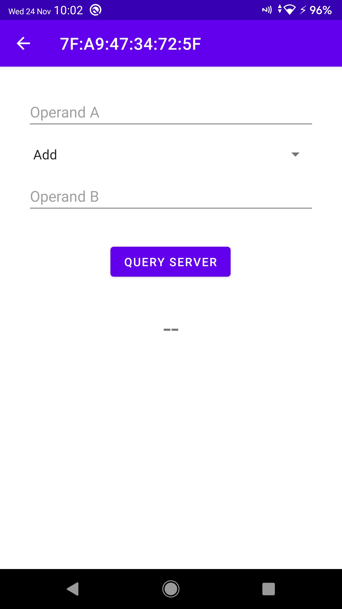

## Android client that connects to Microsofts UWP BluetoothLE example.

Android Studio Kotlin example project that acts as a client to Microsoft's Universal Windows Platform (UWP) BluetoothLE example.

### Limitations

This example project demonstrates the scanning for service uuids and the reading and writing of BLE characteristics. It does not subscribe to charactiristics to listen for value change events.

### Requirements

- Running instance of Microsoft's BluetoothLE UWP on a Bluetooth Low Energy (LE) capable Windows device. This requires Visual Studio 2019 or higher.
- A BluetoothLE capable Android device running on Anrdoid 8.1 or higher.

### Steps to get going

- Download Microsoft's Universal Windows Platform (UWP) BluetoothLE example via https://github.com/microsoft/windows-universal-samples/tree/main/Samples/BluetoothLE.

- Open the BluetoothLE example in Visual Studio and start the application. Then go to 3) Server: publish foreground.

  

- Click 'start service'

- Either run the application in Android Studio or run the application by sideloading the APK on your Android smartphone. You will find the APK in the releases section (go to *[releases](https://github.com/jansoftable/Android-BluetoothLE-Example/releases)*)

  

- Click the 'look for server'-button. Once clicked, the application will scan for BluetoothLE advertisements of the specific service uuid of the Windows-application.

  

- The application navigates to the next activity once a matching service is found. The AppBar shows the current MAC-address of the Windows machine. Note that this address is dynamic and changes regularly. The activity asks for two operands and an operation to perform on them. 

  

- Enter a value for both operands and choose an operation.

  

- Next, click 'query server'-button. The application will write 3 characteristics, that correspond to both operands and operator, to the server. Then, it will perform a read operation on the designated result characteristic to read the result of the calculation from the server. Finally, the application shows the result of the calculation.

  

  

- The server application:

  
